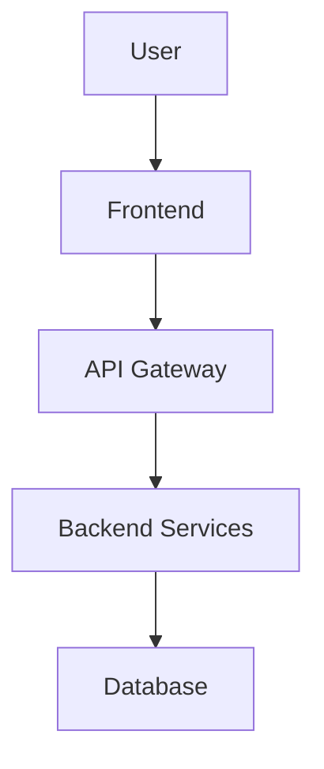

# Architecture Diagrams

This section contains visual representations of our system architecture, including:

- System overview diagrams
- Component interaction diagrams  
- Data flow diagrams
- Deployment diagrams

## Getting Started

Add your architecture diagrams here using:
- Mermaid diagrams (embedded in markdown)
- Image files (PNG, SVG)
- Links to external diagram tools

### Example Mermaid Diagram

